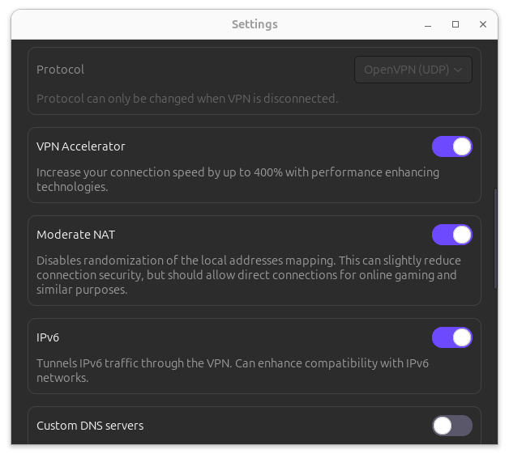
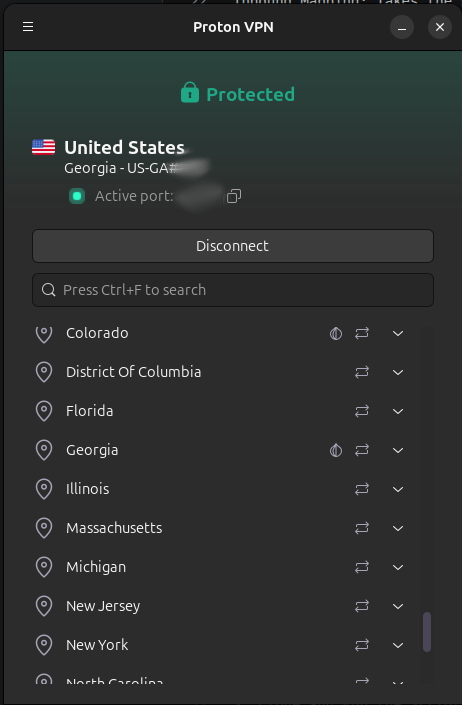

# PS5 Black Ops II Lobby Fix: Bypassing Strict NAT with a Linux VPN Gateway

Route your PS5 through a paid VPN service which allows you to toggle from NAT:strict to NAT:moderate to allow for more peer to peer connections in match making on legacy multiplayer games like Call of Duty Black ops I and II.

## TLDR -- Full guide follows
```bash
# 1. Forward incoming traffic from the VPN Port to the Game's default port
iptables -t nat -A PREROUTING -i $VPN_INTERFACE -p udp --dport $PROTON_PORT -j DNAT --to-destination $PS5_IP:$GAME_PORT
iptables -t nat -A PREROUTING -i $VPN_INTERFACE -p tcp --dport $PROTON_PORT -j DNAT --to-destination $PS5_IP:$GAME_PORT

# 2. Explicitly allow the game traffic through the Linux forwarding chain
iptables -A FORWARD -p udp -d $PS5_IP --dport $GAME_PORT -j ACCEPT
iptables -A FORWARD -p tcp -d $PS5_IP --dport $GAME_PORT -j ACCEPT

# 3. Outbound VPN Port Mapping (Symmetric NAT Bypass)
# This forces the PS5's outbound game traffic to match the exact port Proton gave you.
iptables -t nat -A POSTROUTING -o $VPN_INTERFACE -p udp --sport $GAME_PORT -j SNAT --to-source :$PROTON_PORT
iptables -t nat -A POSTROUTING -o $VPN_INTERFACE -p tcp --sport $GAME_PORT -j SNAT --to-source :$PROTON_PORT
```

## The Problem
*Call of Duty: Black Ops 1 and 2* were recently ported to PlayStation with fresh servers, however, the ports still use peer-to-peer (P2P) matchmaking.

Because of how modern home networks are configured, many players connect to these servers with a **Strict NAT**. This effectively excludes you from the majority of your peers in P2P matchmaking, creating an endless "searching for lobby" loop. This technique will bypass that restriction, and it works for nearly any older P2P multiplayer game for which you can't find a lobby because of NAT:Strict.

### Try These Quick Fixes First
Before you pull this repo, try these standard router fixes. If they work, you don't need the rest

*   **Enable UPnP:** Turn on Universal Plug and Play (UPnP) in your router settings.
*   **Port Forwarding:** Manually forward Port `3074` (TCP/UDP) in your router to your console's local IP.

If neither of those work, your ISP likely uses **CGNAT (Carrier-Grade NAT)**—which is common on 5G, fiber, and apartment networks—or you share an upstream firewall you can't control. The easiest way to circumvent those headaches is by tunneling your traffic through a VPN to achieve a **Moderate/Open NAT**.

---

## The Bird's-Eye Solution
Since you cannot change your ISP's network settings, you have to bypass them entirely. This project uses a paid VPN with port-forwarding capabilities (like Proton VPN) to build an encrypted tunnel right past your ISP's limitations. We then use a Linux PC to bridge that tunnel directly to your console.

### The Technical "Gotcha" This Script Solves
Connecting a console to a PC VPN normally results in a Strict NAT anyway, because Linux and VPNs naturally randomize outgoing ports for security. This script uses native Linux `iptables` to perform two critical tasks:

1.  **Inbound Mapping:** Takes the specific forwarded port given to you by your VPN provider and pushes it straight to your console on port `3074`.
2.  **Outbound Locking (The Secret Sauce):** Overrides standard Linux routing behavior, forcing outbound data from your console to use your exact VPN port. The game client sees a perfect match, tricking it into giving you an open, matchmaker-friendly connection.

---

## Prerequisites
*   **An Ubuntu/Linux PC** with two network connections (e.g., Wi-Fi for internet, and an empty Ethernet port).
*   **An Ethernet Cable** linking your console directly into your Linux PC's ethernet port.
*   **A VPN with Port Forwarding Support.** *(Note: Free tiers generally do not support port forwarding. If you use Proton VPN, you can use [my referral link](https://pr.tn/ref/5KGPTD9Y)) for a 14-day trial and we both get a $20 credit).*
*   **Network Sharing Enabled.** *(On Ubuntu: Go to your wired ethernet settings, select the IPv4 tab, and set the method to "Shared to other computers").*

---

## Step-by-Step Setup

### 1. Configure the VPN
1.  Open your VPN app on your Linux PC.
2.  Ensure Port Forwarding is enabled in your settings *(If using Proton VPN, go to Settings -> Advanced, and toggle the NAT Type from Strict to Moderate)*.



3.  Connect to a P2P-supported server and **copy the 5-digit Forwarded Port Number** displayed on your dashboard.



### 2. Grab Your Local Network Details
Open a terminal (`Ctrl` + `Alt` + `T`) and run `ip addr` to identify your network interface names:

*   **VPN Adapter:** Usually `tun0` or `wg0`.
")
*   **Physical Ethernet:** The port wired to your console (usually `eno2`, `eth0`, or `enp3s0`).
")
*   **Console IP:** Check your console's network settings to find its current IP address (usually assigned automatically by Ubuntu, looking something like `10.42.0.X`).

Settings > Network > Connection Status > View Connection Status

Make sure your console is connected to your PC via ethernet!

### 3. Clone and Run the Script
Clone this repository to your Linux machine:

```bash
git clone https://github.com/TDMillar-Biology/PS5_VPN_P2P/
cd PS5_VPN_P2P
```
Open ps5_vpn.sh in a text editor and update the 4 configuration variables at the very top to match your setup, then Make the script executable and run it with root permissions:

```bash
nano ps5_vpn.sh
chmod +x ps5_vpn.sh
sudo ./ps5_vpn.sh
```

Don't want to clone the repo just for one script? Swap in your variables by hand

```bash
# 1. Forward incoming traffic from the VPN Port to the Game's default port
iptables -t nat -A PREROUTING -i $VPN_INTERFACE -p udp --dport $PROTON_PORT -j DNAT --to-destination $PS5_IP:$GAME_PORT
iptables -t nat -A PREROUTING -i $VPN_INTERFACE -p tcp --dport $PROTON_PORT -j DNAT --to-destination $PS5_IP:$GAME_PORT

# 2. Explicitly allow the game traffic through the Linux forwarding chain
iptables -A FORWARD -p udp -d $PS5_IP --dport $GAME_PORT -j ACCEPT
iptables -A FORWARD -p tcp -d $PS5_IP --dport $GAME_PORT -j ACCEPT

# 3. Outbound VPN Port Mapping (Symmetric NAT Bypass)
# This forces the PS5's outbound game traffic to match the exact port Proton gave you.
iptables -t nat -A POSTROUTING -o $VPN_INTERFACE -p udp --sport $GAME_PORT -j SNAT --to-source :$PROTON_PORT
iptables -t nat -A POSTROUTING -o $VPN_INTERFACE -p tcp --sport $GAME_PORT -j SNAT --to-source :$PROTON_PORT
```


### 4. Clear the Console Cache
Go to your console's network settings menu and select Test Internet Connection. This forces the console to drop its old network memory and fetch the new route.

Launch your p2p game. Your network status indicator will show as Open or Moderate, and matchmaking queues will populate immediately.

License
Distributed under the MIT License. See LICENSE for more information.